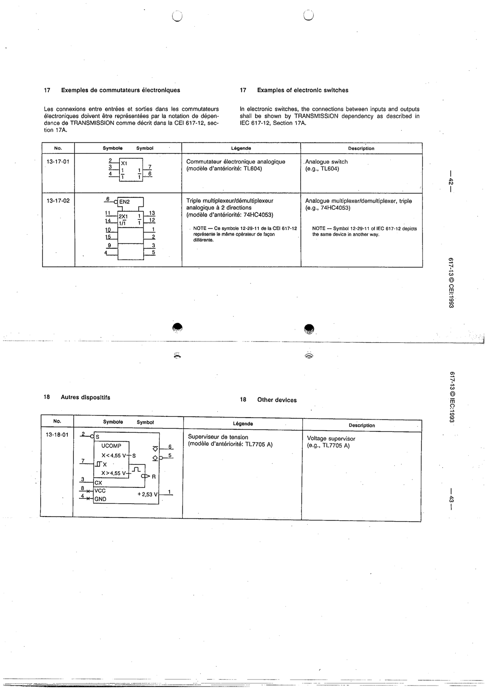

# 13-18-01 — Voltage supervisor (e.g. TL7705A)

This symbol appears on Publication No.617-13.pdf, printed p.43 (full page shown).

**Standard:** [[60617-13]] · **Section:** [[60617-13-18-other-devices]]

## Description
Example: voltage supervisor (UCOMP, thresholds at 4.55 V), device TL7705A.

## Names
- **EN:** Voltage supervisor (e.g. TL7705A)
- **FR:** Superviseur de tension (par exemple TL7705A)

## Related
- **TL7705A**
